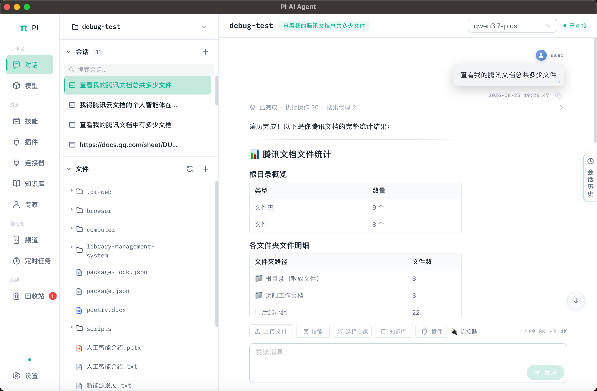

# PI AI Agent

PI AI Agent 是一个基于 [pi-coding-agent](https://github.com/earendil-works/pi) 的开源 AI 编程助手。它提供桌面端图形界面，用于管理项目、会话、模型、文件和开发任务，也支持在浏览器中运行 Web 界面。

[](https://github.com/gcc-luo/pi-web-ui/releases)
[](#许可证)

## 功能概览

- **AI 对话**：流式消息、Markdown 渲染、代码高亮、工具调用和 Token 用量展示。
- **模型管理**：支持 Google、OpenAI、Anthropic、OpenRouter 和自定义模型，可在会话中切换模型。
- **项目与会话**：管理多个项目和会话，支持文件树、会话历史、子会话和回收站。
- **知识库**：导入文档，使用全文检索和向量检索为会话提供上下文。
- **技能与专家**：管理本地技能、技能市场、自定义专家和预设专家。
- **开发工具**：编码模式、内嵌终端、Artifact 展示和定时任务。
- **消息渠道**：可选集成微信、钉钉等消息渠道。
- **桌面应用**：基于 Tauri 2 构建 Windows、macOS 和 Linux 安装包。

## 界面预览



## 技术栈

| 模块     | 技术                                     |
| -------- | ---------------------------------------- |
| Web 前端 | Vue 3、TypeScript、Pinia、Vite、Naive UI |
| 服务端   | Fastify、TypeScript、SQLite、WebSocket   |
| 桌面端   | Tauri 2、Rust                            |
| Agent    | pi-coding-agent（Node.js，RPC）          |
| 检索     | SQLite FTS5、jieba、向量搜索             |

## 快速开始

### 环境要求

- Node.js 20 或更高版本
- pnpm 9.6.0（仓库通过 `packageManager` 固定版本）
- Rust stable（仅构建桌面端时需要）

桌面端安装包需要 Node.js 22.19 或更高版本，因为打包过程会生成内置服务端运行时。

### 安装依赖

```bash
corepack enable
corepack prepare pnpm@9.6.0 --activate
pnpm install
```

### 配置环境变量

复制示例配置并填写至少一个模型服务商的 API Key：

```bash
cp .env.example .env
```

Windows PowerShell：

```powershell
Copy-Item .env.example .env
```

常用配置如下：

```dotenv
PORT=8080
HOST=127.0.0.1
LOG_LEVEL=info

# 支持 google、openai、anthropic、openrouter
PI_PROVIDER=google
PI_MODEL=
GOOGLE_API_KEY=
```

完整配置项和示例请参阅 [.env.example](.env.example)。

### 启动开发环境

```bash
pnpm start
```

该命令会启动服务端和 Tauri 桌面开发窗口。服务端默认监听 `http://127.0.0.1:8080`，前端开发服务器默认使用 `http://localhost:3000`。

只启动浏览器开发环境时，可以在服务端运行后执行：

```bash
pnpm --filter @pi-web-ui/web dev
```

浏览器前端通过 Vite 将 `/api` 和 `/ws` 请求代理到本地服务端。

## 构建与发布

### 构建 Web 和服务端

```bash
pnpm build
```

### 构建桌面端安装包

```bash
pnpm --filter @pi-web-ui/desktop build
```

桌面端构建会自动完成以下步骤：

1. 构建服务端并生成生产依赖部署。
2. 生成 Node.js sidecar 和服务端运行时压缩包。
3. 运行服务端健康检查及桌面端 CORS 预检检查。
4. 执行 Tauri 构建并生成安装包。

产物位于：

```text
apps/desktop/src-tauri/target/release/bundle/
```

根据操作系统会生成不同格式的安装包，例如 Windows 的 `.msi` / `.exe`、macOS 的 `.dmg` 和 Linux 的 `.deb` / `.AppImage`。

如需单独准备 sidecar：

```bash
pnpm --filter @pi-web-ui/desktop prepare-sidecar
```

## 常用命令

| 命令                                           | 用途                            |
| ---------------------------------------------- | ------------------------------- |
| `pnpm start`                                   | 启动服务端和桌面开发环境        |
| `pnpm dev`                                     | 并行启动各 workspace 的开发脚本 |
| `pnpm build`                                   | 构建所有 workspace              |
| `pnpm test`                                    | 运行各 workspace 的测试         |
| `pnpm typecheck`                               | 执行 TypeScript 类型检查        |
| `pnpm stop`                                    | 停止本地开发进程                |
| `pnpm --filter @pi-web-ui/desktop build:debug` | 构建桌面调试包                  |

## 数据目录

应用默认将数据保存在用户目录下的 `.pi-web-ui`：

```text
~/.pi-web-ui/
├── pi-web-ui.sqlite       # SQLite 数据库
├── logs/                  # 服务端日志
├── kb-files/              # 知识库文件
└── wechat-session/        # 微信登录会话（如启用）
```

可以通过 `PI_WEB_UI_ROOT` 修改数据根目录。请不要将包含 API Key 或登录凭据的 `.env`、数据库和会话目录提交到版本库。

## 仓库结构

```text
pi-web-ui/
├── apps/
│   ├── web/               # Vue 3 Web 前端
│   ├── server/            # Fastify API、WebSocket 和 Agent 桥接
│   └── desktop/           # Tauri 桌面端及 sidecar 打包脚本
├── packages/
│   └── shared/            # 前后端共享类型
├── docs/                  # 文档和界面图片
├── patches/               # 第三方依赖补丁
├── scripts/               # 仓库级开发脚本
├── .env.example           # 环境变量示例
└── pnpm-workspace.yaml    # pnpm workspace 配置
```

## 开发说明

- API 路由位于 `apps/server/src/routes/`。
- 数据库初始化和迁移位于 `apps/server/src/db/`。
- Web 页面和组件位于 `apps/web/src/`。
- Tauri 配置和 Rust 代码位于 `apps/desktop/src-tauri/`。
- 修改桌面端服务端逻辑后，请使用 `pnpm --filter @pi-web-ui/desktop build` 重新生成安装包，避免携带旧的 sidecar。

## 贡献

欢迎提交 Issue 和 Pull Request。提交代码前建议运行：

```bash
pnpm test
pnpm typecheck
```

## 许可证

本项目采用 MIT License。第三方依赖的许可证以各自项目声明为准。
